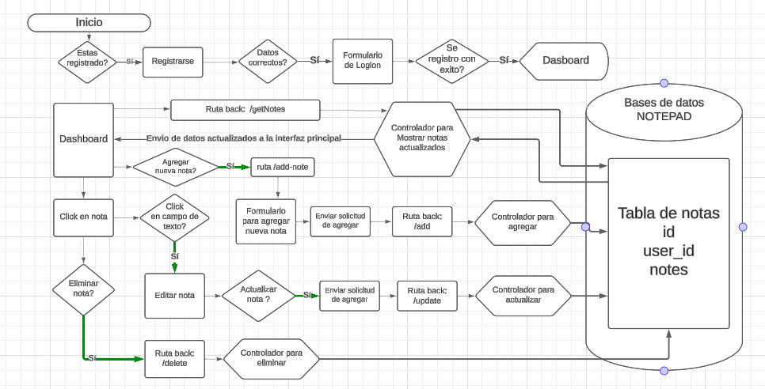

## NotePad: Gestor de notas

Como dice el titulo es un gestor de notas utilizando los 4 pasos fundamentales de gestión, crear, leer, editar y eliminar.

Demo: []()

## 🛠 Tecnologías:
- Este proyecto fue realizado con las siguientes tecnologias y dependencias:
  - [](https://www.php.net/)
  - [](https://api.jquery.com/)
  - [](https://developer.mozilla.org/en-US/docs/Web/CSS)

## 📈 Diagrama de flujo:

- Este es un pequeño diagrama del planteamiento y seguimiento estatico del proyecto.

<div align="center">
  
</div>

## 📱💻 Diseño responsivo (mobile & tablet):

- Estos son los diferentes vistas para cualquier dispositivo.
<div align="center">
   
   
</div>

## 🛠️ Instalación:
### Pre-requisitos. 
> Instalar XAMPP.
>> Instalar PHP.

### Installation
>> Clonar el repositorio.
  ```sh
   git clone https://github.com/juanRCoder/NotePad.git
   ```
>> Mover el proyecto a la carpeta htdocs de XAMPP.
  ```sh
   local/XAMPP/htdocs/
   ```
>> Primera vista de la aplicación y empezar.
  ```sh
  http://localhost/NotePad/src/index.php
   ```

## 🧑 Autor: Juan Ramirez

- Linkedin: [@Juan Ramirez](https://www.linkedin.com/in/juan-ramirez-490b84271/)
- Instagram: [@juanrcoder](https://www.instagram.com/juanrcoder/)

### Proyecto:

- Demo: []()

## Licence:

- Este proyecto está bajo la Licencia MIT - ver el archivo [LICENSE](LICENSE) para más detalles.